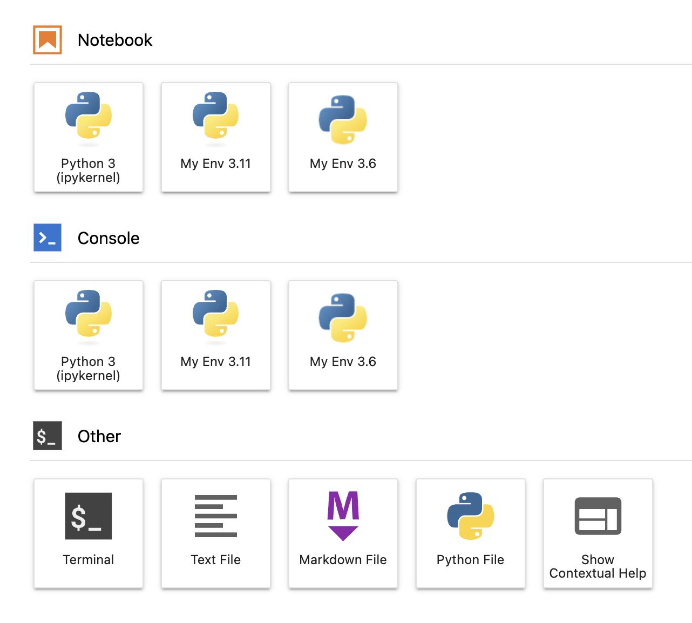

# SLE BCI container with JupyterHub

## Container Details

* Container image is ~787 MB
* JupyterHub and JupyterLab services run as `APP_USER`
* JupyterHub is launched with local user authentication
    * Username: `APP_UNAME`
    * UID: `APP_UID`
    * Password: `APP_PASS`
* JupyterHub Ports
    * Docker: 8888/tcp as defined in `compose.yml`
    * Helm: 30000-32767/tcp as defined in `bci-jupyterhub-helm/values.yaml`
* JupterHub launches JupyterLab after authentication
* JupyterLab environment
    * `entrypoint.sh` installs Python virtual environments and configures each virtual environment as an ipykernel
    * Python 3.6: `~/venv/3.6` 
    * Python 3.11: `~/venv/3.11`




## Docker Deployment

### 1. Build Image
```bash
docker buildx build -t bci-jupyterhub -f Dockerfile .
```

### 2. Configure & Run

The `compose.yml` requires environment variables to be set beforehand

#### **Variables**

* `APP_UNAME`:  the conainer username that runs jupyterhub (default = jupyter)
* `APP_UID`:    the uid for the container username (default = 1000)
* `APP_PASS`:   the password for the container username (default = CHANGEME)

#### **Example Run**
```bash
export APP_PASS="YOUR_SECURE_PASSWORD_HERE"
export APP_UNAME=$USER
export APP_UID=$(id -u)

docker compose up -d
```
Access via port mapped in `compose.yml` (e.g., `http://localhost:8888`)

# Kubernetes / Rancher Deployment (Helm)

See [bci-jupyterhub-helm/README.md](./bci-jupyterhub-helm/README.md)

# Reference

- https://denibertovic.com/posts/handling-permissions-with-docker-volumes/
- https://registry.suse.com/
- https://jupyter.org/


